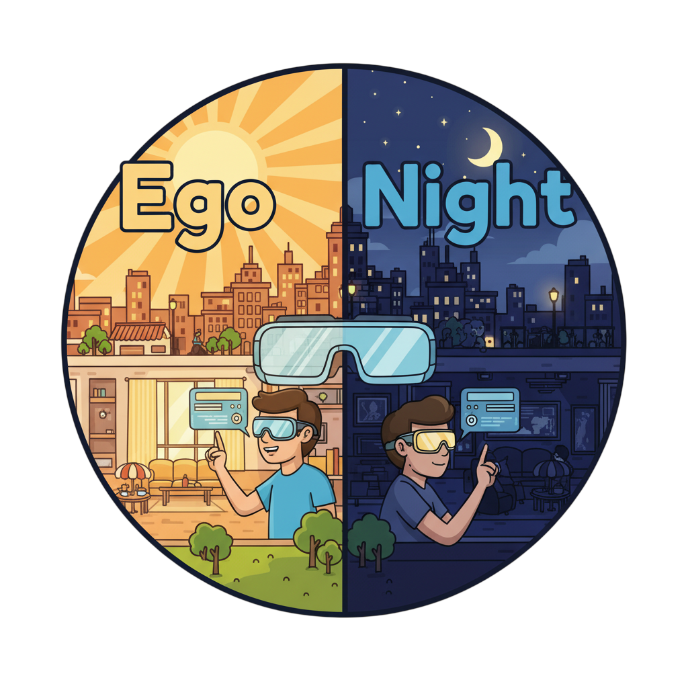

<p align="center">
    
</p>

<div align="center">

<h1 align="center">EgoNight: Towards Egocentric Vision Understanding at Night with a Challenging Benchmark</h1>

<h4 align="center"><em><a href="https://dehezhang2.github.io/">Deheng Zhang</a>*, <a href="https://yuqianfu.com/">Yuqian Fu</a>*✉, <a href="https://runyiyang.github.io/">Runyi Yang</a>, <a href="https://y9miao.github.io/">Yang Miao</a>, <a href="https://qiantianwen.github.io/">Tianwen Qian</a>, <a href="https://zhengxujosh.github.io/">Xu Zheng</a>,</em></h4>
<h4 align="center"><em><a href="https://guoleisun.github.io/">Guolei Sun</a>, <a href="https://ajadchhatkuli.github.io/">Ajad Chhatkuli</a>, <a href="https://xuanjing-huang.github.io/">Xuanjing Huang</a>, <a href="https://www.yugangjiang.info/">Yu-Gang Jiang</a>, <a href="https://insait.ai/prof-luc-van-gool/">Luc Van Gool</a>, <a href="https://people.ee.ethz.ch/~paudeld/">Danda Pani Paudel</a></em></h4>

<p align="center">
    
</p>

\* *Equal Contribution* &nbsp; &nbsp; *Corresponding Author* ✉

</div>

<p align="center">
    <a href="https://arxiv.org/abs/2510.06218"></a>
    <a href="https://openreview.net/forum?id=DKD4QbOKBN"></a>
    <a href="https://dehezhang2.github.io/EgoNight/"></a>
    <a href="https://huggingface.co/datasets/dehezhang2/EgoNight"></a>
</p>

<p align="center">
  <a href="#news">News</a> |
  <a href="#overview">Overview</a> |
  <a href="#todo">TODO</a> |
  <a href="#acknowledgement">Acknowledgement</a> |
  <a href="#citation">Citation</a> |
  <a href="#license">License</a>
</p>

## News

- **[2026]** EgoNight is accepted by **ICLR 2026**. 
- **[2025/10]** Our paper "[EgoNight: Towards Egocentric Vision Understanding at Night with a Challenging Benchmark](https://arxiv.org/abs/2510.06218)" is available on [arXiv](https://arxiv.org/abs/2510.06218).
- **[2025/10]** Paper and supplementary materials available on [OpenReview](https://openreview.net/forum?id=DKD4QbOKBN).


---

## Overview

The benchmark assesses vision-language models on egocentric video question answering across diverse scenarios. It supports both **night** (default) and **day** imagery, with a curated subset of question types for paired day/night comparison. Open-source VLMs (GLM-4V, Qwen2.5-VL, InternVL, LLaVA-NeXT-Video, etc.) are evaluated using the [LLaMA Factory](https://github.com/hiyouga/LlamaFactory) API server.

### Question Types

- Object Recognition
- Spatial Reasoning
- Scene Sequence
- Non Common
- Counting
- Navigation
- Text Recognition
- Action

---

## TODO

### Done

- [x] **VQA evaluation** — Full pipeline for EgoNight-VQA (GPT, Gemini, Qwen, scoring, summarization).
- [x] **[LLaMA Factory](https://github.com/hiyouga/LlamaFactory)** — Open-source VLM evaluation via API server (GLM-4V, Qwen2.5-VL, InternVL, LLaVA-NeXT-Video).

### Planned

- [ ] **Depth evaluation** — Evaluation pipeline for egocentric depth estimation at night (auxiliary task from the paper).
- [ ] **Retrieval evaluation** — Evaluation pipeline for day–night correspondence retrieval (auxiliary task from the paper).
- [x] **[LMMs-Eval](https://github.com/EvolvingLMMs-Lab/lmms-eval)** — Added EgoNight export pipeline and drop-in task scaffold under `exports/lmms_eval_task/egonight/`.
- [x] **[VLMEvalKit](https://github.com/open-compass/VLMEvalKit)** — Added EgoNight export pipeline and custom dataset scaffold under `exports/vlmevalkit/egonight_dataset.py`.

---

## Project Structure

```
EgoNight/
├── exports/
│   ├── build_egonight_exports.py          # Build JSONL/TSV exports for external eval toolkits
│   ├── README.md                          # Integration steps for LMMs-Eval and VLMEvalKit
│   ├── generated/                         # Generated files: egonight_lmms_eval.jsonl, EgoNight.tsv, stats
│   ├── lmms_eval_task/
│   │   └── egonight/
│   │       ├── egonight.yaml              # Drop-in lmms-eval task config
│   │       └── utils.py                   # Prompt/visual mapping and metric aggregation
│   └── vlmevalkit/
│       └── egonight_dataset.py            # Drop-in VLMEvalKit dataset class
├── evaluation/
│   ├── evaluate_gemini.py    # Gemini 2.5 Pro inference
│   ├── evaluate_gpt.py       # GPT-4.1 inference
│   ├── evaluate_qwen7b.py    # Qwen 2.5 VL 7B inference (LLaMA Factory API)
│   ├── score_gpt.py          # GPT-4o as judge scoring (correct/incorrect, 0–5)
│   ├── summarize_accuracy.py # Per-dataset and overall accuracy summary
│   ├── evaluate_all.sh       # Batch evaluation over subfolders
│   ├── api_keys.py           # API key loading
│   ├── keys.env.example      # Template for API keys
│   └── keys.env              # Your keys (create from example, gitignored)
├── README.md
└── LICENSE
```

---

## Data Format

Each evaluation sample is a subfolder with:

```
<subfolder>/
├── qa_result/
│   ├── all_qa_filtered.json       # Question-answer annotations
│   ├── *_results*.json            # Model outputs (gpt, gemini, qwen7b)
│   └── *_scores*.json             # Score outputs (created by score_gpt.py)
└── extracted_frames/
    ├── Night/                     # Night images (jpg/png)
    └── Day/                       # Day images (optional)
```

### Frame sampling

- **EgoNight-Sofia** and **EgoNight-Oxford**: frames sampled at 1 fps
- **EgoNight-Synthetic**: frames sampled at 2 fps

Evaluators infer the dataset from the path and use the correct sampling rate in the prompt.

### all_qa_filtered.json

List of objects with fields:

| Field          | Description                          |
|----------------|--------------------------------------|
| `question`     | The question text                    |
| `question_type`| One of the question types above      |
| `answer`       | Ground-truth answer                  |
| `start_frame`  | First frame index (0-based)          |
| `end_frame`    | Last frame index (inclusive)         |

---

## Setup

### 1. Dependencies

```bash
pip install openai google-generativeai tqdm pyyaml numpy pillow requests
```

### 2. API Keys (GPT & Gemini)

1. Copy the example keys file:
   ```bash
   cp evaluation/keys.env.example evaluation/keys.env
   ```
2. Edit `evaluation/keys.env` with your keys:
   ```
   OPENAI_API_KEY=sk-your-openai-key
   GEMINI_API_KEY=your-gemini-api-key
   ```

   Alternatively, set `OPENAI_API_KEY` and `GEMINI_API_KEY` as environment variables.

### 3. Open-Source VLMs via LLaMA Factory (Optional)

Part of the open-source VLM evaluation relies on the [LLaMA Factory](https://github.com/hiyouga/LlamaFactory?tab=readme-ov-file#deploy-with-openai-style-api-and-vllm) API server. Others are evaluated using the official repo. Start the API server with the desired model before running the corresponding evaluator. 

Example configs for supported VLMs (based on LLaMA Factory [`examples/inference/`](https://github.com/hiyouga/LlamaFactory/tree/main/examples/inference)):

| Model | Config | Hugging Face Model |
|-------|--------|--------------------|
| **GLM-4V** | `glm4v.yaml` | `zai-org/GLM-4.1V-9B-Base` |
| **Qwen2.5-VL-7B** | `qwen2_5vl_7B.yaml` | `Qwen/Qwen2.5-VL-7B-Instruct` |
| **InternVL3** | `intern_vl.yaml` | `OpenGVLab/InternVL3-8B-hf` |
| **LLaVA-NeXT-Video** | `llava_video.yaml` | `llava-hf/LLaVA-NeXT-Video-7B-32K-hf` |

**Example configs** (save as YAML and run `llamafactory-cli api <config.yaml>`):

```yaml
# glm4v.yaml
model_name_or_path: zai-org/GLM-4.1V-9B-Base
template: glm4v
infer_backend: huggingface
trust_remote_code: true
```

```yaml
# qwen2_5vl_7B.yaml
model_name_or_path: Qwen/Qwen2.5-VL-7B-Instruct
template: qwen2_vl
infer_backend: huggingface  # choices: [huggingface, vllm, sglang]
trust_remote_code: true
```

```yaml
# intern_vl.yaml
model_name_or_path: OpenGVLab/InternVL3-8B-hf
template: intern_vl
infer_backend: huggingface
trust_remote_code: true
```

```yaml
# llava_video.yaml
model_name_or_path: llava-hf/LLaVA-NeXT-Video-7B-32K-hf
template: llava_next_video
infer_backend: huggingface
trust_remote_code: true
```

Start the API server (default port 8000):
```bash
API_PORT=8000 llamafactory-cli api examples/inference/qwen2_5vl_7B.yaml
```
---

## Usage

### Single Sample

```bash
# GPT-4.1 (night images)
python evaluation/evaluate_gpt.py --dir_path /path/to/sample_folder

# GPT-4.1 (day images)
python evaluation/evaluate_gpt.py --dir_path /path/to/sample_folder --use_day True

# Gemini 2.5 Pro
python evaluation/evaluate_gemini.py --dir_path /path/to/sample_folder

# Qwen 7B (requires local server on port 8004)
python evaluation/evaluate_qwen7b.py --dir_path /path/to/sample_folder
```

### Batch Evaluation

Provide a parent directory containing one subfolder per sample:

```bash
bash evaluation/evaluate_all.sh /path/to/parent_directory
```

This runs the active evaluators (GPT, Gemini, Qwen7b) in parallel per sample, then scores results with GPT-4o. For `sofia_oxford`, scores are written to each subfolder’s `score/` directory.

### Scoring

`score_gpt.py` takes prediction JSONs (filenames containing `result` and `.json`), compares them to ground truth via GPT-4o, and writes scored files (`results` → `scores` in the filename):

```bash
python evaluation/score_gpt.py --dir_path /path/to/results_directory
```

### Summarize Accuracy

`summarize_accuracy.py` computes per-dataset (Sofia, Oxford, Synthetic) and overall accuracy by QA type, and also breaks down accuracy by **difficulty level** (easy/medium/hard) using built-in scene difficulty metadata. It reads `*_scores_*.json` from each subfolder and filters by `all_qa_filtered.json` (Sofia/Oxford) or scores all entries (Synthetic). This difficulty summary is included in both console and JSON output.

difficulty results are reported per dataset and overall.

difficulty levels are easy, medium, and hard.

```bash
python evaluation/summarize_accuracy.py \
    --sofia_path /path/to/Sofia_server \
    --oxford_path /path/to/Oxford_server \
    --synthetic_path /path/to/Synthetic_server \
    [--model gpt] [--split night] \
    [--output results/summary.json]
```

Example output:
```
=== Model: gpt | Split: night ===

--- Sofia ---
  Action: 72.50% (29/40)
  Counting: 68.00% (17/25)
  ...
  OVERALL: 70.00% (105/150)

--- OVERALL (all datasets combined) ---
  Action: 71.00% (..)
  ...
  OVERALL: 69.50% (..)

--- DIFFICULTY BREAKDOWN (per dataset) ---
  Sofia:
    easy:   75.00% (60/80)
    medium: 65.00% (26/40)
    hard:   55.00% (11/20)
  Oxford:
    easy:   70.00% (..)
    medium: 62.00% (..)
    hard:   50.00% (..)
  Synthetic:
    easy:   80.00% (..)
    medium: 68.00% (..)
    hard:   52.00% (..)

--- DIFFICULTY BREAKDOWN (overall) ---
  easy:   78.00% (..)
  medium: 65.00% (..)
  hard:   52.00% (..)
```

The output JSON (via `--output`) includes `per_dataset`, `overall`, `per_dataset_difficulty`, and `overall_difficulty` keys.

### Visualization Server

`evaluation/server.py` launches an interactive Flask web server that reads pre-computed score files on disk and serves a dark-theme single-page application for exploring benchmark results.

**Features:**
- Filter by split (day/night), dataset (Sofia/Oxford/Synthetic), difficulty (easy/medium/hard), and QA type
- Accuracy overview with stat cards and per-QA-type progress bars
- Individual QA pair drill-down: question, ground truth, model prediction, score, correct/incorrect
- Paginated results table with color-coded rows

**Using the bundled local data (recommended):**

The repository includes pre-computed score files under `data/` for 10 models (gpt, gemini, intern_vl, qwen3b, qwen7b, qwen72b, glm4v, video_llama3, llava_next_video, egogpt):

```bash
python evaluation/server.py \
    --sofia_path data/Sofia_server \
    --oxford_path data/Oxford_server \
    --synthetic_path data/synthetic_server \
    [--model gpt] [--port 5000]
```

**Using your own score files:**

```bash
python evaluation/server.py \
    --sofia_path /path/to/Sofia_server \
    --oxford_path /path/to/Oxford_server \
    --synthetic_path /path/to/synthetic_server \
    [--model gpt] [--port 5000]
```

Then open `http://localhost:5000` in your browser. Requires `flask` (`pip install flask`).

### Export for LMMs-Eval and VLMEvalKit

Build EgoNight exports from local dataset roots:

```bash
python exports/build_egonight_exports.py \
  --oxford /data/Night_Ego_Dataset/EgoNight/EgoNight_Oxford \
  --sofia /data/Night_Ego_Dataset/EgoNight/EgoNight_Sofia \
  --synthetic /data/Night_Ego_Dataset/EgoNight/EgoNight_synthetic \
  --output_dir exports/generated
```

This generates:

- `exports/generated/egonight_lmms_eval.jsonl` (for LMMs-Eval)
- `exports/generated/EgoNight.tsv` (for VLMEvalKit)
- `exports/generated/egonight_export_stats.json`

LMMs-Eval scaffold files are under `exports/lmms_eval_task/egonight/`.
VLMEvalKit scaffold file is under `exports/vlmevalkit/egonight_dataset.py`.
Detailed integration steps are in `exports/README.md`.

---

## Output

| Evaluator | Output File           |
|-----------|------------------------|
| GPT       | `gpt_results.json` / `gpt_results_day.json` |
| Gemini    | `gemini_results.json` / `gemini_results_day.json` |
| Qwen 7B   | `qwen7b_results.json` / `qwen7b_results_day.json` |

Each result JSON contains entries with `Q` (question), `A` (prediction), `C` (ground truth), `M` (category), and frame indices.

Scoring produces `*_scores.json` with GPT-4o evaluations: correct/incorrect, 0–5 score, and reasoning.

---

## Acknowledgement

We thank the following projects and resources:

- **[Oxford day and night dataset](https://oxdan.active.vision/)** for providing day and night egocentric sequences used in EgoNight-Oxford.
- **[LLaMA Factory](https://github.com/hiyouga/LlamaFactory)** for the unified API server enabling efficient evaluation of open-source vision-language models.
- **[Blender](https://www.blender.org/)** for the open-source 3D creation suite used to render synthetic day–night aligned videos in EgoNight-Synthetic.
- **[Infinigen](https://github.com/princeton-vl/infinigen)**  for the indoor scene generation used in EgoNight-Synthetic
---

## Citation

If you find EgoNight useful for your research, please cite our paper:

```bibtex
@inproceedings{zhang2026egonight,
  title={EgoNight: Towards Egocentric Vision Understanding at Night with a Challenging Benchmark},
  author={Zhang, Deheng and Fu, Yuqian and Yang, Runyi and Miao, Yang and Qian, Tianwen and Zheng, Xu and Sun, Guolei and Chhatkuli, Ajad and Huang, Xuanjing and Jiang, Yu-Gang and Van Gool, Luc and Paudel, Danda Pani},
  booktitle={International Conference on Learning Representations (ICLR)},
  year={2026}
}
```

---

## License

GNU General Public License v3.0. See [LICENSE](LICENSE) for details.
